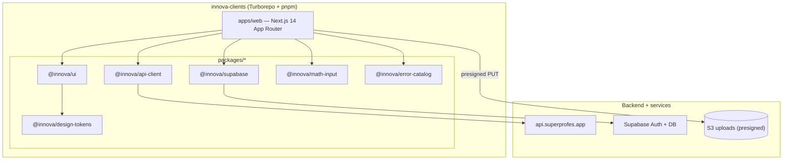

# innova-clients

> Turborepo monorepo with the client applications and shared packages of the **SuperProfe / Innova**
> platform. Live in production at **https://app.superprofes.app** (and the public landing at
> **https://superprofes.app**).
>
> Turborepo · pnpm · Next.js 14 (App Router) · TypeScript strict · Supabase Auth (`@supabase/ssr`) · Vercel · EAS (mobile)

---

## Table of contents

- [1. Overview](#1-overview)
- [2. Architecture](#2-architecture)
- [3. Apps and packages](#3-apps-and-packages)
- [4. Tech stack](#4-tech-stack)
- [5. Environment variables](#5-environment-variables)
- [6. Local setup](#6-local-setup)
- [7. Testing](#7-testing)
- [8. Production deployment](#8-production-deployment)
- [9. Conventions](#9-conventions)
- [10. License](#10-license)

---

## 1. Overview

This monorepo holds the front end of SuperProfe. The current shipping app is a **single Next.js 14 App Router
application** (`apps/web`) that serves both the public landing and the authenticated product, with role-based
route groups for student, teacher, parent and admin. Shared logic (API client, Supabase helpers, design
tokens, UI components, math input, error catalog) lives in versioned workspace packages so the web app and the
future Expo mobile apps consume the same code.

It talks to:

- `https://api.superprofes.app` — the core backend (`innova-backend-serverless`).
- Supabase — authentication (`@supabase/ssr`, httpOnly cookies) shared across `*.superprofes.app`.
- S3 (via backend presigned URLs) — worksheet and submission photo uploads.

---

## 2. Architecture



`apps/web/app/` route groups:

```
app/
├── page.tsx          # public landing (superprofes.app)
├── (auth)/           # login / register / password reset (Supabase)
├── (student)/        # student practice + scan flow
├── (teacher)/        # teacher dashboard: heatmaps, alerts, guides, assignments
├── (parent)/         # parent summaries
├── (admin)/          # error-catalog admin
├── (guides)/         # role-adaptive guide views (upload, review, submit)
└── (account)/        # account settings
```

---

## 3. Apps and packages

**Apps**

| Path | Framework | Purpose |
|------|-----------|---------|
| `apps/web` | Next.js 14 (App Router, React 18) | Landing + role-based product (student/teacher/parent/admin) |

> The env template also covers Expo mobile apps (`apps/mobile-student`, `apps/mobile-parent`) and an Astro
> landing; mobile ships via EAS and is on the roadmap. The web app currently serves the landing from `/`.

**Packages (`packages/*`, all `@innova/*`)**

| Package | Responsibility |
|---------|----------------|
| `@innova/api-client` | Typed client for the backend API (Zod schemas + inferred types) |
| `@innova/supabase` | `createBrowserClient` / `createServerClient` / middleware helpers (`@supabase/ssr`) |
| `@innova/ui` | Design system (shadcn/ui base + Tailwind tokens), consumed as a package |
| `@innova/design-tokens` | Colors, spacing, typography tokens |
| `@innova/math-input` | Math keyboard + WYSIWYG math field (MathLive) for web and native |
| `@innova/error-catalog` | Shared error taxonomy types + human-readable error rendering |

---

## 4. Tech stack

| Concern | Choice |
|---------|--------|
| Monorepo | Turborepo (`turbo.json`: `dev`, `build`, `lint`, `typecheck`, `test`, `format`) |
| Package manager | pnpm 10 (workspace protocol, `pnpm-workspace.yaml`) |
| Web framework | Next.js 14 App Router, React 18, Server Components |
| Language | TypeScript strict (`noImplicitAny`, `strictNullChecks`, `exactOptionalPropertyTypes`) |
| Auth | Supabase via `@supabase/ssr` (httpOnly cookies, cookie domain `.superprofes.app`) |
| Validation | Zod at form and API boundaries |
| Styling | Tailwind CSS + design tokens; dark mode via semantic tokens |
| Math UI | MathLive (`@innova/math-input`) |
| Tests | Vitest + React Testing Library (unit), Playwright (E2E) |
| Web deploy | Vercel (native Git integration) |
| Mobile deploy | Expo EAS Build + EAS Update (on demand) |

---

## 5. Environment variables

Template in `.env.example`. `NEXT_PUBLIC_*` and `EXPO_PUBLIC_*` are exposed to the client; never prefix a
secret with them. `SUPABASE_SERVICE_ROLE_KEY` is server-only. In production these live **in Vercel**, not in
GitHub.

```env
# apps/web (Next.js)
NEXT_PUBLIC_API_URL=https://api.superprofes.app
NEXT_PUBLIC_SUPABASE_URL=https://<project>.supabase.co
NEXT_PUBLIC_SUPABASE_ANON_KEY=
SUPABASE_SERVICE_ROLE_KEY=            # server-only, NEVER NEXT_PUBLIC_
NEXT_PUBLIC_S3_UPLOAD_BUCKET=innova-ocr-uploads-prod
NEXT_PUBLIC_SITE_URL=https://app.superprofes.app
NEXT_PUBLIC_COOKIE_DOMAIN=.superprofes.app   # shared session across subdomains

# Expo mobile apps
EXPO_PUBLIC_API_URL=https://api.superprofes.app
EXPO_PUBLIC_SUPABASE_URL=https://<project>.supabase.co
EXPO_PUBLIC_SUPABASE_ANON_KEY=
```

---

## 6. Local setup

### Prerequisites

- Node.js ≥20 (via `nvm`)
- pnpm 10 (`corepack enable && corepack prepare pnpm@10.10.0 --activate`)
- A running backend (`../innova-backend-serverless` on `http://localhost:3000`) and a Supabase project

### Steps

```bash
# 1. Install the whole workspace
pnpm install

# 2. Environment
cp .env.example .env            # fill Supabase + API URL (point to local or prod backend)

# 3. Run the web app (Turborepo)
pnpm dev                        # turbo run dev --parallel
# apps/web → http://localhost:3000 (or the next free port if backend uses 3000)

# 4. Quality checks
pnpm typecheck
pnpm lint
pnpm test
```

Run a single workspace with a filter, e.g. `pnpm --filter @innova/web dev` or
`pnpm --filter @innova/ui test`.

---

## 7. Testing

```bash
pnpm test                       # unit (Vitest) across the workspace
pnpm --filter @innova/api-client test    # a single package
pnpm exec playwright test       # E2E web flows (Playwright)
```

Shared packages carry unit tests with a ≥75% coverage target; apps carry Playwright E2E smoke tests for the
critical flows (teacher heatmap + resolve alert, student submit attempt, guide upload/review/submit). UI PRs
run Playwright smoke and attach screenshots (see `docs/SMOKE_TESTING.md`).

---

## 8. Production deployment

Web is deployed by **Vercel's native Git integration** (not GitHub Actions). The authoritative runbook is
`../docs/DEPLOY_RUNBOOK.md` §3.

### Web (Vercel)

- Vercel project `superprofes-web`, importing `vruizz22/innova-clients`, **Root Directory `apps/web`**,
  framework Next.js, build `turbo run build`, install `pnpm install`.
- Domains: `app.superprofes.app` and/or `superprofes.app` (DNS: `CNAME → cname.vercel-dns.com` for the
  subdomain, `A 76.76.21.21` for the apex, as Vercel instructs).
- Environment variables set in Vercel (Production + Preview): `NEXT_PUBLIC_API_URL`,
  `NEXT_PUBLIC_SUPABASE_URL`, `NEXT_PUBLIC_SUPABASE_ANON_KEY`, `SUPABASE_SERVICE_ROLE_KEY`,
  `NEXT_PUBLIC_SITE_URL`, `NEXT_PUBLIC_COOKIE_DOMAIN`.
- Merging the release PR (`develop` → `main`) makes Vercel redeploy automatically.

### Mobile (EAS)

- `.github/workflows/deploy-mobile.yml` runs EAS Build + EAS Update **on demand** (triggered by a
  `mobile-v*` tag, not on every merge, to save build minutes). Secrets: `EAS_TOKEN`, `EXPO_PUBLIC_*`.

### CI

`.github/workflows/ci.yml` runs typecheck + lint + unit (Vitest) + Playwright smoke on every PR.
`.github/workflows/deploy-web.yml` is gated to `workflow_dispatch` so there is no double deploy alongside
Vercel's native integration.

### Verify

- `https://superprofes.app` (landing) and `https://app.superprofes.app` (app) load.
- A real login against Supabase + `https://api.superprofes.app` succeeds.

---

## 9. Conventions

- TypeScript strict, no `any` (use `unknown` + type guards / generics). All API responses typed via
  `@innova/api-client`.
- Next.js App Router: data fetching in async Server Components, not `useEffect`.
- Session tokens via `@supabase/ssr` httpOnly cookies (web) / SecureStore (native) — never `localStorage`.
- COPPA / Law 21.180: no third-party analytics that capture PII; telemetry carries only `student_uuid`.
- Gitflow with `develop` integration branch and protected `main`; Conventional Commits in English.

---

## 10. License

Innova — Team 23. Internal GPL-3.0 license.
