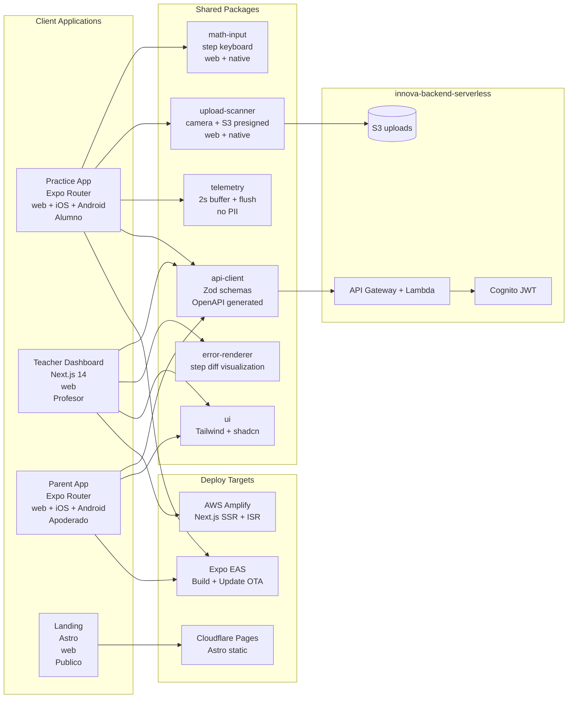

# innova-clients

> Monorepo Turborepo de todas las aplicaciones cliente de **Innova EdTech** — detección de errores matemáticos procedurales, 3°–6° básico chileno.
>
> Turborepo · pnpm · Next.js 14 App Router · Expo SDK 51 · Astro · TypeScript strict · AWS Amplify · Cloudflare Pages · EAS

---

## Tabla de contenidos

- [innova-clients](#innova-clients)
  - [Tabla de contenidos](#tabla-de-contenidos)
  - [1. Visión general](#1-visión-general)
  - [2. Arquitectura](#2-arquitectura)
  - [3. Apps y plataformas](#3-apps-y-plataformas)
    - [apps/practice (Expo Router)](#appspractice-expo-router)
    - [apps/teacher (Next.js 14 App Router)](#appsteacher-nextjs-14-app-router)
    - [apps/parent (Expo Router)](#appsparent-expo-router)
    - [apps/landing (Astro)](#appslanding-astro)
  - [4. Stack tecnológico](#4-stack-tecnológico)
  - [5. Estructura del monorepo](#5-estructura-del-monorepo)
  - [6. Metodología y flujo de trabajo](#6-metodología-y-flujo-de-trabajo)
    - [6.1 GSD / BMAD](#61-gsd--bmad)
    - [6.2 AI usage logs](#62-ai-usage-logs)
    - [6.3 Gitflow](#63-gitflow)
    - [6.4 Quality gates](#64-quality-gates)
    - [6.5 Reglas obligatorias](#65-reglas-obligatorias)
  - [7. Variables de entorno](#7-variables-de-entorno)
    - [Next.js apps (apps/teacher)](#nextjs-apps-appsteacher)
    - [Expo apps (apps/practice, apps/parent)](#expo-apps-appspractice-appsparent)
  - [8. Setup local](#8-setup-local)
    - [Prerrequisitos](#prerrequisitos)
    - [Instalación](#instalación)
    - [Correr apps individualmente](#correr-apps-individualmente)
    - [Comandos globales (Turborepo)](#comandos-globales-turborepo)
  - [9. Tests y cobertura](#9-tests-y-cobertura)
    - [Suites clave](#suites-clave)
    - [Configuración MSW (Mock Service Worker)](#configuración-msw-mock-service-worker)
  - [10. Despliegue](#10-despliegue)
    - [Web apps (apps/teacher) → AWS Amplify](#web-apps-appsteacher--aws-amplify)
    - [Astro landing → Cloudflare Pages](#astro-landing--cloudflare-pages)
    - [Mobile apps (apps/practice, apps/parent) → Expo EAS](#mobile-apps-appspractice-appsparent--expo-eas)
    - [Re-deploy tras cambios](#re-deploy-tras-cambios)
    - [CI/CD (GitHub Actions)](#cicd-github-actions)
  - [11. Decisión de deploy: AWS Amplify vs Vercel](#11-decisión-de-deploy-aws-amplify-vs-vercel)
    - [Por qué Amplify sobre Vercel](#por-qué-amplify-sobre-vercel)
  - [12. Diseño y UI/UX](#12-diseño-y-uiux)
    - [Stack visual](#stack-visual)
    - [Tokens de diseño](#tokens-de-diseño)
    - [Accesibilidad](#accesibilidad)
  - [13. Privacidad y cumplimiento NNA](#13-privacidad-y-cumplimiento-nna)
  - [14. Roadmap](#14-roadmap)
  - [15. Recursos](#15-recursos)
  - [16. Licencia](#16-licencia)

---

## 1. Visión general

Este monorepo contiene las **aplicaciones cliente** que exponen la plataforma Innova a sus tres tipos de usuario:

| Usuario | App | Necesidad |
|---------|-----|-----------|
| Alumno | `apps/practice` | Hacer ejercicios paso a paso o escanear worksheet; ver feedback inmediato |
| Profesor | `apps/teacher` | Ver heatmap de dominio por skill, alertas de alumnos en riesgo, asignar práctica |
| Apoderado | `apps/parent` | Ver asignaciones del hijo, progreso de dominio, recibir notificaciones push |
| Público | `apps/landing` | Página institucional de Innova |

**Integración de plataformas por usuario:**

| App | Web | iOS | Android | Desktop |
|-----|-----|-----|---------|---------|
| `apps/practice` | ✅ MVP | ✅ MVP | ✅ MVP | post-MVP |
| `apps/teacher` | ✅ MVP | — | — | post-MVP |
| `apps/parent` | ✅ MVP | ✅ MVP | ✅ MVP | post-MVP |
| `apps/landing` | ✅ MVP | — | — | — |

---

## 2. Arquitectura



> Diagramas UML formales en `docs/drawio/`. Guía de construcción en Draw.io: `docs/drawio/01-how-to-draw-high-level-architecture.md`.

---

## 3. Apps y plataformas

### apps/practice (Expo Router)

Flujos principales:

1. Alumno entra a asignación → selecciona ejercicio.
2. **Input digital**: `packages/math-input` renderiza teclado numérico + filas de steps. Cada step se guarda en telemetry buffer.
3. Submit final → `POST /api/attempts` con `rawSteps[]`.
4. Feedback: `is_correct`, label del tipo de error (human-readable), animación de ánimo.
5. **Input foto**: `packages/upload-scanner` abre cámara, strip EXIF, presigned S3 upload. Poll `/api/attempts/:id/status` hasta que OCR + clasificación terminen.

### apps/teacher (Next.js 14 App Router)

Vistas:

1. **Heatmap de classroom**: grilla (alumno × skill) con color por `p_known`. Verde ≥0.7, amarillo 0.4–0.7, rojo <0.4.
2. **Panel de alertas**: `TeacherAlert` sin resolver, ordenados por urgencia. Botón "Marcar resuelto".
3. **Drill-down alumno**: historial de intentos, frecuencia de errores por tipo, evolución de `p_known`.
4. **Asignar práctica**: seleccionar alumno/grupo → genera `PracticeAssignment` con ítems recomendados por Fisher information.

### apps/parent (Expo Router)

Vistas:

1. Lista de `PracticeAssignment` activas del hijo.
2. Barras de progreso de dominio por skill (sin mostrar números crudos — solo colores y etiquetas amigables).
3. Push notification cuando se crea nueva asignación (`expo-notifications`).
4. Tap en ejercicio → abre `apps/practice` (in-app webview o redirect).

### apps/landing (Astro)

Página institucional estática: propuesta de valor, cómo funciona, contacto. Deployed en Cloudflare Pages.

---

## 4. Stack tecnológico

| Capa | Tecnología | Versión | Razón |
|------|-----------|---------|-------|
| Monorepo | Turborepo + pnpm | latest | Pipeline de tasks, caché de builds, workspace protocol |
| Lenguaje | TypeScript strict | 5.x | `noImplicitAny`, `exactOptionalPropertyTypes` |
| Web framework | Next.js 14 App Router | 14+ | SSR/ISR/Streaming, Server Components |
| Mobile framework | Expo SDK + Expo Router | 51+ | Web + iOS + Android desde un codebase |
| Static site | Astro | 4+ | Zero JS by default, ideal para landing |
| Auth | AWS Cognito + Amplify Auth | — | Mismo ecosystem que backend |
| Estilos | Tailwind CSS v3 | 3.x | Utility-first, tree-shakeable |
| UI primitives | shadcn/ui + Radix UI | — | Headless, accesible, customizable |
| Validación | Zod | 3+ | Runtime validation + inferred types |
| HTTP client | fetch nativo + wrapper tipado | — | Sin axios, `api-client` package custom |
| Charts | recharts | 2.x | Lightweight, para heatmap y barras |
| Notif. push | expo-notifications | — | iOS + Android + web |
| Tests unit | Vitest + React Testing Library | latest | Fast, ESM-native |
| Tests E2E | Playwright | latest | Web flows, Chromium + WebKit |
| Mocking API | MSW (Mock Service Worker) | 2+ | Mocks a nivel de red, compartido unit+e2e |
| Coverage | v8 provider | — | Gate ≥75% en `packages/*` |
| Deploy web | AWS Amplify Gen 2 | — | Next.js SSR nativo, mismo ecosystem AWS |
| Deploy static | Cloudflare Pages | — | Free, global CDN, zero cold start |
| Deploy mobile | Expo EAS | — | EAS Build + EAS Update OTA |
| Package manager | pnpm | 9+ | Workspace, eficiencia disco |

---

## 5. Estructura del monorepo

```
innova-clients/
├── turbo.json                       # pipeline de tasks (build, test, lint)
├── pnpm-workspace.yaml
├── package.json                     # root scripts
├── apps/
│   ├── practice/                    # Expo Router (web + iOS + Android)
│   │   ├── app/                     # Expo Router file-based routing
│   │   │   ├── (auth)/
│   │   │   ├── (student)/
│   │   │   │   ├── index.tsx        # lista de asignaciones
│   │   │   │   └── exercise/[id].tsx
│   │   │   └── _layout.tsx
│   │   ├── components/
│   │   ├── hooks/
│   │   ├── app.json
│   │   └── package.json
│   ├── teacher/                     # Next.js 14 App Router
│   │   ├── app/
│   │   │   ├── (auth)/
│   │   │   ├── dashboard/
│   │   │   │   ├── classroom/[id]/  # heatmap + alertas
│   │   │   │   └── student/[id]/   # drill-down alumno
│   │   │   └── layout.tsx
│   │   ├── components/
│   │   │   ├── MasteryHeatmap.tsx
│   │   │   ├── AlertsPanel.tsx
│   │   │   └── ErrorFrequencyChart.tsx
│   │   ├── next.config.js
│   │   └── package.json
│   ├── parent/                      # Expo Router (web + iOS + Android)
│   │   ├── app/
│   │   └── package.json
│   └── landing/                     # Astro
│       ├── src/pages/
│       └── package.json
├── packages/
│   ├── math-input/                  # teclado matemático step-by-step
│   │   ├── src/
│   │   │   ├── MathInput.tsx        # web
│   │   │   └── MathInput.native.tsx # native
│   │   └── package.json
│   ├── upload-scanner/              # cámara + presigned S3
│   │   ├── src/
│   │   └── package.json
│   ├── telemetry/                   # buffer 2s + flush
│   │   ├── src/
│   │   │   ├── buffer.ts
│   │   │   └── flush.ts
│   │   └── package.json
│   ├── api-client/                  # cliente HTTP tipado
│   │   ├── src/
│   │   │   ├── attempts.ts
│   │   │   ├── mastery.ts
│   │   │   └── alerts.ts
│   │   └── package.json
│   ├── error-renderer/              # visualiza diff de steps
│   │   └── package.json
│   └── ui/                          # design system
│       ├── src/
│       │   └── components/
│       └── package.json
├── e2e/                             # Playwright specs globales
│   ├── teacher-heatmap.spec.ts
│   ├── practice-submit.spec.ts
│   └── parent-assignment.spec.ts
└── .github/
    └── workflows/
        ├── ci.yml
        ├── deploy-web.yml
        └── deploy-mobile.yml
```

---

## 6. Metodología y flujo de trabajo

### 6.1 GSD / BMAD

Artefactos en `docs/` (repo raíz `innova/`):

| Archivo | Propósito |
|---------|-----------|
| `docs/roadmap.md` | Milestones M0–M6 con fechas |
| `docs/milestones.md` | Sprints, DoR, DoD |
| `docs/requirements.md` | RF/NFR trazables |

### 6.2 AI usage logs

Cada sesión de Claude Code → log en `docs/ai-logs/YYYY-MM-DD-<tema>.md`. Incluir: Prompt · Output resumido · Decisión · Tradeoffs.

### 6.3 Gitflow

```
main (protegida) <── feature/<app-scope>
                  <── fix/<scope>
```

- `main` protegida: PR obligatorio, ≥2 reviewers, CI verde.
- Conventional Commits en inglés: `feat(practice): add step-by-step math input`, `fix(telemetry): flush on unload event`
- Squash and merge.

### 6.4 Quality gates

| Gate | Criterio | Bloquea merge |
|------|---------|---------------|
| `pnpm -r run type-check` | 0 errores TS | ✅ |
| `pnpm -r run lint` | 0 errores ESLint | ✅ |
| `pnpm -r run test:coverage` | ≥75% en `packages/*` | ✅ |
| `pnpm -r run build` | exit 0 | ✅ |
| Playwright E2E (en push) | happy paths OK | ✅ |
| Reviewers | 2 aprobados | ✅ |

### 6.5 Reglas obligatorias

- **Nunca `localStorage` para session tokens** — httpOnly cookies (web) / `expo-secure-store` (native).
- **Nunca analytics que capturen PII** (no GA4 user_id, no Amplitude, no Mixpanel).
- Solo `student_uuid` en payloads de API — nunca nombre ni email.
- `useEffect` para data fetching está prohibido en Next.js App Router — usar async Server Components.
- Todos los componentes React: definir interfaz `Props` explícita.

---

## 7. Variables de entorno

Validadas en build-time. **Nunca commitear `.env.local` ni `.env`.**

### Next.js apps (apps/teacher)

```env
NEXT_PUBLIC_API_URL=https://api.innova.cl
NEXT_PUBLIC_COGNITO_USER_POOL_ID=
NEXT_PUBLIC_COGNITO_CLIENT_ID=
NEXT_PUBLIC_COGNITO_REGION=us-east-1
NEXT_PUBLIC_S3_UPLOAD_BUCKET=innova-uploads
```

Validadas con `@t3-oss/env-nextjs` (Zod schemas) en `src/env.ts`.

### Expo apps (apps/practice, apps/parent)

```env
EXPO_PUBLIC_API_URL=https://api.innova.cl
EXPO_PUBLIC_COGNITO_CLIENT_ID=
EXPO_PUBLIC_COGNITO_REGION=us-east-1
```

---

## 8. Setup local

### Prerrequisitos

- Node.js ≥20 (recomendado vía `nvm`)
- pnpm ≥9: `corepack enable && corepack prepare pnpm@latest --activate`
- Para Expo mobile:
  - iOS: Xcode + iOS Simulator
  - Android: Android Studio + Emulator (o dispositivo físico)
  - `eas-cli`: `pnpm add -g eas-cli`

### Instalación

```bash
# 1. Clonar
git clone git@github.com:<org>/innova-clients.git
cd innova-clients

# 2. Instalar todas las dependencias del workspace
pnpm install

# 3. Variables de entorno
cp apps/teacher/.env.example apps/teacher/.env.local
cp apps/practice/.env.example apps/practice/.env.local
cp apps/parent/.env.example apps/parent/.env.local
# editar cada archivo con API_URL, COGNITO_* vars
```

### Correr apps individualmente

```bash
# Teacher dashboard (web)
pnpm --filter apps/teacher dev
# → http://localhost:3000

# Practice app (Expo web)
pnpm --filter apps/practice start
# → http://localhost:8081

# Practice app (iOS simulator)
pnpm --filter apps/practice ios

# Practice app (Android emulator)
pnpm --filter apps/practice android

# Parent app (Expo web)
pnpm --filter apps/parent start

# Landing (Astro)
pnpm --filter apps/landing dev
# → http://localhost:4321
```

### Comandos globales (Turborepo)

```bash
pnpm -r run build           # build de todos los apps y packages
pnpm -r run test            # unit tests en todos
pnpm -r run test:coverage   # con cobertura
pnpm -r run lint            # lint en todos
pnpm -r run type-check      # type-check en todos
```

---

## 9. Tests y cobertura

```bash
# Unit tests (Vitest)
pnpm -r run test

# Con cobertura (gate ≥75% en packages/)
pnpm --filter "./packages/**" run test:coverage

# E2E Playwright (teacher dashboard)
pnpm --filter apps/teacher run test:e2e

# E2E en modo UI interactivo
pnpm --filter apps/teacher exec playwright test --ui

# Watch mode para desarrollo
pnpm --filter packages/telemetry run test --watch
```

### Suites clave

| Suite | App/Package | Qué verifica |
|-------|------------|-------------|
| `buffer.test.ts` | `packages/telemetry` | Flush en 2s, flush en 50 eventos, retry 3x |
| `no-pii.test.ts` | `packages/telemetry` | Eventos no contienen `student_name`, `email`, `@` |
| `MathInput.test.tsx` | `packages/math-input` | `onStepSubmit` con step_index + duration_ms correctos |
| `AttemptForm.test.tsx` | `apps/practice` | Submit con `rawSteps[]`, feedback correcto/incorrecto |
| `classroom-heatmap.spec.ts` | `apps/teacher` (E2E) | Heatmap colors por `p_known`, badge de alertas |
| `alert-resolution.spec.ts` | `apps/teacher` (E2E) | Marcar alerta → desaparece + toast confirmación |

Spec completo: `docs/prompt/03-innova-clients-testing.md`

### Configuración MSW (Mock Service Worker)

Handlers compartidos en `packages/api-client/src/mocks/handlers.ts`. Importar en `setupTests.ts` de cada app/package.

---

## 10. Despliegue

### Web apps (apps/teacher) → AWS Amplify

```bash
# Deploy manual (override)
amplify push --yes

# O via GitHub Actions (automático en merge a main)
# .github/workflows/deploy-web.yml
```

Amplify detecta automáticamente Next.js 14 App Router, SSR, ISR. Variables de entorno configuradas en Amplify Console → Environment Variables.

### Astro landing → Cloudflare Pages

```bash
pnpm --filter apps/landing build
# Cloudflare Pages detecta el push a main y deploya dist/ automáticamente
```

Configurar en Cloudflare Dashboard: Build command = `pnpm build`, Output directory = `dist`.

### Mobile apps (apps/practice, apps/parent) → Expo EAS

```bash
# Login EAS (primera vez)
eas login

# Configurar proyecto (primera vez)
eas init

# Build producción (iOS + Android)
eas build --platform all --profile production

# Actualización OTA (solo cambios JS, sin re-build nativo)
eas update --branch main --message "descripción del update"

# Submit a App Store / Play Console
eas submit --platform ios
eas submit --platform android
```

### Re-deploy tras cambios

```bash
git pull origin main

# Web: Amplify hace deploy automático en push a main

# Mobile OTA (sin nuevo build nativo):
eas update --branch main --message "fix: improve step input validation"

# Mobile con cambios nativos (requiere nuevo build):
eas build --platform all --profile production
eas submit --platform all
```

### CI/CD (GitHub Actions)

`.github/workflows/ci.yml` — en cada PR:

1. `pnpm -r run type-check` → `pnpm -r run lint` → `pnpm -r run test:coverage`
2. `pnpm -r run build` (verifica sin errores de build)
3. Playwright E2E (en push)

`.github/workflows/deploy-web.yml` — en merge a main:

1. Build teacher app
2. Deploy a AWS Amplify via Amplify CLI

`.github/workflows/deploy-mobile.yml` — en merge a main:

1. `eas update --branch main` para OTA a practice + parent

---

## 11. Decisión de deploy: AWS Amplify vs Vercel

**Decisión: AWS Amplify Gen 2** para apps Next.js. **Cloudflare Pages** para Astro. **Expo EAS** para mobile.

### Por qué Amplify sobre Vercel

| Criterio | AWS Amplify | Vercel |
|---------|------------|--------|
| Next.js 14 App Router / SSR / ISR | ✅ soporte nativo | ✅ excelente |
| Integración Cognito | ✅ mismo ecosystem, sin cross-cloud auth | ⚠️ requiere config adicional |
| Integración S3 presigned URLs | ✅ IAM nativo | ⚠️ cross-cloud |
| Costo MVP | ✅ Free tier: 1000 build min + 15 GB storage + 5 GB data out | ⚠️ $20/mes mínimo por team |
| Vendor lock-in | ✅ dentro del ecosistema AWS ya elegido | ❌ agrega segundo vendor |
| DX (Developer Experience) | ✅ buena, CLI maduro | ✅ excelente |

**Por qué Cloudflare Pages para Astro:**

- Sitio 100% estático → zero cold starts, global CDN, literalmente free.
- Amplify cobraría por requests de CDN en un sitio que no necesita SSR.

**Por qué EAS para mobile:**

- OTA updates sin re-submit a stores → iteración más rápida en MVP.
- EAS Build provee builds reproducibles en cloud (sin necesitar Mac propio para iOS).

Documentado como ADR-011 en `docs/architecture.md`.

---

## 12. Diseño y UI/UX

### Stack visual

| Tecnología | Uso |
|-----------|-----|
| Tailwind CSS v3 | Utility-first, todas las apps web |
| shadcn/ui + Radix UI | Componentes accesibles (Dialog, DropdownMenu, Badge) para apps Next.js |
| NativeWind | Tailwind en Expo (mobile) |
| Lucide React | Iconos tree-shakeable |
| recharts | Heatmap y barras de progreso (teacher dashboard) |
| expo-haptics | Feedback táctil en practice app |

### Tokens de diseño

Definidos en `packages/ui/src/tokens.css`:

- `--color-mastery-high`: verde (#16a34a) — p_known ≥ 0.7
- `--color-mastery-mid`: amarillo (#ca8a04) — p_known 0.4–0.7
- `--color-mastery-low`: rojo (#dc2626) — p_known < 0.4

### Accesibilidad

- Touch targets mínimos 44×44px (WCAG 2.1 AA + COPPA friendly)
- High contrast mode support en `packages/math-input`
- `aria-label` en todos los botones del teclado matemático
- `role="status"` en toasts de feedback

---

## 13. Privacidad y cumplimiento NNA

Los alumnos son menores de edad. Aplica:

| Regulación | Medida implementada |
|-----------|-------------------|
| COPPA (USA) | Sin analytics que capturen user_id. Sin cookies de terceros en apps de alumnos. |
| Ley 21.180 (Chile) | Solo `student_uuid` en payloads — nunca nombre ni RUT. |
| Session security | httpOnly cookies (web) + `expo-secure-store` (native) — nunca `localStorage` |
| Datos de menores | No se comparten con terceros analíticos (no GA4 user_id, no Amplitude) |
| Upload de fotos | EXIF stripped en `packages/upload-scanner` antes del presigned PUT |
| Telemetry | Solo `attempt_id`, `event_type`, `payload` matemático — cero identificadores personales |

---

## 14. Roadmap

| Milestone | Fecha | Entregable |
|-----------|-------|-----------|
| M0 | 29 abr | Especificaciones, ADRs, taxonomía de errores |
| M1 | 30 abr | Instructions + prompts + drawio |
| M2 | 3 may | Backend skeleton (Entrega 2) |
| M3 | 17 may | AI engine |
| **M4 — Frontend** | **7 jun (Entrega 3)** | `apps/practice` (web + Expo) + `apps/teacher` + `apps/parent` + packages core |
| M5 | 12 jun | Integration pilot (~20 alumnos, 1 curso piloto) |
| **M6 — Hardening** | **19 jun (Entrega 4)** | E2E Playwright completo, monitoring, pitch incubadora |

---

## 15. Recursos

- Especificaciones backend: `.github/instructions/07-implementacion-backend.md`
- Deployment y DevOps: `.github/instructions/08-deployment-y-devops.md`
- Costos y escalabilidad: `.github/instructions/09-costos-y-escalabilidad.md`
- Testing spec completo: `docs/prompt/03-innova-clients-testing.md`
- Prompt de implementación: `docs/prompt/03-innova-clients.md`
- ADRs (incluye ADR-011 Amplify vs Vercel): `docs/architecture.md`

---

## 16. Licencia

Innova - Team 23. Internal GPL-3.0 License.
