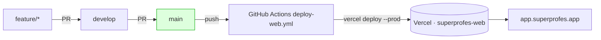

# Deploy & CI/CD — innova-clients (Vercel + EAS)

> **Autoridad:** este documento **reemplaza** a `docs/GITHUB_SECRETS_SETUP.md` (obsoleto:
> describe `apps/practice`/`apps/teacher`/landing-S3 + Cognito, todo deprecado).
> Hoy el repo tiene **una sola app**: `apps/web` (Next.js 14 + Supabase Auth).
> Última revisión: 2026-06-14.

---

## 1. Arquitectura de deploy

| Target | Quién lo deploya | Trigger | URL prod |
|---|---|---|---|
| `apps/web` | **GitHub Actions** (`deploy-web.yml`) → Vercel | push a `main` + `workflow_dispatch` | `https://app.superprofes.app` |
| `apps/mobile-*` | `deploy-mobile.yml` (EAS) | **PARKEADO** (manual) — las apps aún no existen | — |
| Landing (`superprofes.app`) | (pendiente: Vercel o redirect 301) | — | `https://superprofes.app` |

**Regla de oro:** el **único** que deploya web es GitHub Actions en `main`. La integración
Git nativa de Vercel debe quedar **desactivada para ramas** (ver §4), porque hoy es la que
genera deploys en `feature/*` y `develop` y los que fallan en proyectos huérfanos.



---

## 2. Política de ramas

- CI (`ci.yml`) corre en `main`, `feature/**`, `fix/**` y PRs → `main`. ✅ correcto (feedback temprano).
- **Deploy SOLO en `main`** (`deploy-web.yml`). No tocar este trigger.
- Flujo: `feature/<nombre>` → PR → `develop` → PR → `main`. El deploy ocurre al mergear a `main`.

---

## 3. Secrets de GitHub Actions — qué, dónde y cómo

📍 **Dónde se ponen:** GitHub → repo `innova-clients` → **Settings → Secrets and variables → Actions → New repository secret**
URL directa: `https://github.com/vruizz22/innova-clients/settings/secrets/actions`

### 3.1 Secrets REQUERIDOS (sin estos, `deploy-web.yml` falla)

| Secret | Qué es | Dónde obtenerlo | Formato / ejemplo |
|---|---|---|---|
| `VERCEL_TOKEN` | Token de acceso a Vercel CLI | vercel.com → avatar → **Account Settings → Tokens → Create** (scope: Full Account, sin expiración o larga) | `xxxxxxxxxxxxxxxxxxxxxxxx` |
| `VERCEL_ORG_ID` | ID de tu org/team en Vercel | Proyecto → **Settings → General** (o `.vercel/project.json` tras `vercel link`) | `team_xxx` o `prj_org_xxx` |
| **`VERCEL_PROJECT_ID_WEB`** ⚠️ | ID del proyecto Vercel de `apps/web` | Proyecto `superprofes-web` → **Settings → General → Project ID** | `prj_xxxxxxxxxxxx` |
| `NEXT_PUBLIC_API_URL` | URL del backend | Fijo del proyecto | `https://api.superprofes.app` |
| **`NEXT_PUBLIC_SUPABASE_URL`** ⚠️ | URL del proyecto Supabase | supabase.com → tu proyecto → **Settings → Data API → Project URL** (o **API**) | `https://<ref>.supabase.co` |
| **`NEXT_PUBLIC_SUPABASE_ANON_KEY`** ⚠️ | Clave pública (anon) de Supabase | Supabase → **Settings → API Keys → anon / public** | `eyJhbGci...` (JWT largo) |

> ⚠️ = **lo que hoy te FALTA**. El último deploy a `main` murió con
> *"You specified VERCEL_ORG_ID but you forgot to specify VERCEL_PROJECT_ID"* porque
> `VERCEL_PROJECT_ID_WEB` no existe. El front usa Supabase (14 archivos, 0 Cognito), así que
> los `NEXT_PUBLIC_SUPABASE_*` también son obligatorios para el build.

### 3.2 Opcional (solo si una server-route lo usa)

| Secret | Qué es | Dónde | Nota |
|---|---|---|---|
| `SUPABASE_SERVICE_ROLE_KEY` | Clave admin server-only | Supabase → **Settings → API Keys → service_role** | **NUNCA** con prefijo `NEXT_PUBLIC_`. Solo si `app/auth/callback` u otra route server la necesita. |

### 3.3 Secrets OBSOLETOS — borrar (limpieza)

Borra estos en `Settings → Secrets`; ya no los usa ningún workflow:

```
NEXT_PUBLIC_COGNITO_CLIENT_ID      EXPO_PUBLIC_COGNITO_CLIENT_ID
NEXT_PUBLIC_COGNITO_USER_POOL_ID   EXPO_PUBLIC_COGNITO_REGION
NEXT_PUBLIC_PRACTICE_URL           NEXT_PUBLIC_TEACHER_URL
NEXT_PUBLIC_PARENT_URL             NEXT_PUBLIC_LANDING_URL
PUBLIC_PRACTICE_URL                PUBLIC_TEACHER_URL
PUBLIC_PARENT_URL                  PUBLIC_LANDING_URL
PUBLIC_API_URL
VERCEL_PROJECT_ID_PRACTICE         VERCEL_PROJECT_ID_TEACHER
S3_BUCKET_NAME                     CLOUDFRONT_DISTRIBUTION_ID
AWS_ACCESS_KEY_ID  AWS_SECRET_ACCESS_KEY  AWS_REGION   ← solo si NO usas S3/CloudFront (ADR-103/104 dejó S3 por Vercel)
```

> Mantén `EAS_TOKEN` y `EXPO_PUBLIC_API_URL` para cuando reactives mobile.

---

## 4. Vercel — configuración del Dashboard (CRÍTICO para "deploy solo en main")

📍 `https://vercel.com/<tu-team>/`

1. **Borrar/desconectar proyectos huérfanos.** Tienes proyectos Vercel `innova-clients-practice`
   y `teacher` conectados por Git que **deployan en cada push de cualquier rama** y **fallan
   siempre** (su código `apps/practice`/`apps/teacher` ya no existe en el monorepo).
   - Cada uno → **Settings → General → Delete Project** (o **Settings → Git → Disconnect**).
   - Esto elimina tus "deploys en feature/develop" de raíz.

2. **Proyecto real `superprofes-web`** (el de `apps/web`):
   - **Settings → General → Production Branch =** `main`.
   - **Settings → Git → Ignored Build Step** → pon un comando que cancele builds de no-main, p.ej.:

     ```bash
     bash -c "[ \"$VERCEL_GIT_COMMIT_REF\" = main ] && exit 1 || exit 0"
     ```

     (exit 0 = *skip build*; así Vercel no auto-deploya ramas). **O** desactiva
     *Automatic deployments from Git* y deja que **solo Actions** deploye.
   - **Settings → General → Root Directory =** `apps/web` (si Vercel-Git quedara activo).
   - Copia el **Project ID** → secret `VERCEL_PROJECT_ID_WEB` (§3.1).

3. **Variables de entorno en Vercel** (para que el runtime del SSR las tenga, no solo el build):
   **Settings → Environment Variables** (scope *Production*): `NEXT_PUBLIC_API_URL`,
   `NEXT_PUBLIC_SUPABASE_URL`, `NEXT_PUBLIC_SUPABASE_ANON_KEY` (+ `SUPABASE_SERVICE_ROLE_KEY` si aplica).

---

## 5. Pasos para dejarlo deployado (checklist)

1. [ ] Vercel: borrar proyectos `practice`/`teacher`; dejar solo `superprofes-web` (§4).
2. [ ] GitHub secrets: crear `VERCEL_PROJECT_ID_WEB`, `NEXT_PUBLIC_SUPABASE_URL`, `NEXT_PUBLIC_SUPABASE_ANON_KEY` (§3.1).
3. [ ] (Opcional) borrar secrets obsoletos (§3.3).
4. [ ] Confirmar `next build` local OK (pendiente R9) y quitar `continue-on-error` del step *Build web* en `ci.yml`.
5. [ ] Disparar deploy: `git push origin main` **o** Actions → *Deploy Web (Vercel)* → **Run workflow**.
6. [ ] Verificar (ver §6).

---

## 6. Verificación post-deploy

- GitHub Actions verde: `https://github.com/vruizz22/innova-clients/actions/workflows/deploy-web.yml`
- App responde: `curl -I https://app.superprofes.app` → `200`/`307`.
- Login Supabase funciona (no errores de `SUPABASE_URL` en consola del navegador).
- En Vercel → Deployments: el último *Production* es del commit de `main` y su estado es **Ready**.

---

## 7. Troubleshooting (fallos reales ya vistos)

| Síntoma | Causa | Fix |
|---|---|---|
| `forgot to specify VERCEL_PROJECT_ID` | `VERCEL_PROJECT_ID_WEB` ausente | Crear el secret (§3.1) |
| Deploys en `feature/*`/`develop` fallando | Proyectos Vercel-Git huérfanos `practice`/`teacher` | Borrarlos (§4.1) |
| `Vercel – innova-clients-practice failed` | Mismo origen | Idem |
| Build sin Supabase (página en blanco / auth roto) | faltan `NEXT_PUBLIC_SUPABASE_*` | Crear secrets + env en Vercel (§3.1, §4.3) |
| Warning *Node.js 20 actions deprecated* | actions viejas | Ya bumpeadas a checkout@v5 / setup-node@v5 |
